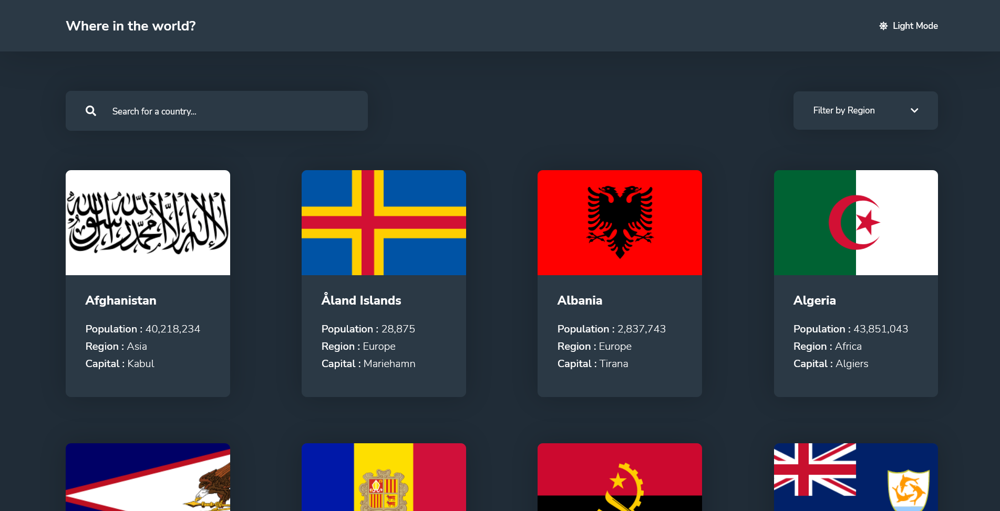

# Frontend Mentor - REST Countries API with color theme switcher solution

This is a solution to the [REST Countries API with color theme switcher challenge on Frontend Mentor](https://www.frontendmentor.io/challenges/rest-countries-api-with-color-theme-switcher-5cacc469fec04111f7b848ca). Frontend Mentor challenges help you improve your coding skills by building realistic projects.

## The challenge

Users should be able to:

- See all countries from the API on the homepage
- Search for a country using an `input` field
- Filter countries by region
- Click on a country to see more detailed information on a separate page
- Click through to the border countries on the detail page
- Toggle the color scheme between light and dark mode *(optional)*

### Links

- [Solution URL](https://www.frontendmentor.io/solutions/rest-countries-app-F3tGGmSil)
- [Live Site URL](https://rest-countries-app-one.vercel.app)

## Built with

- [React](https://reactjs.org/) - JS library
- [Scss](https://www.sass-lang.com) - CSS Preprocessor
- [React Router](https://reactrouter.com/) - Router for React.js
## Author

- [Frontend Mentor](https://www.frontendmentor.io/profile/arshWebDev)
- [Twitter](https://www.twitter.com/arshWebDev)
